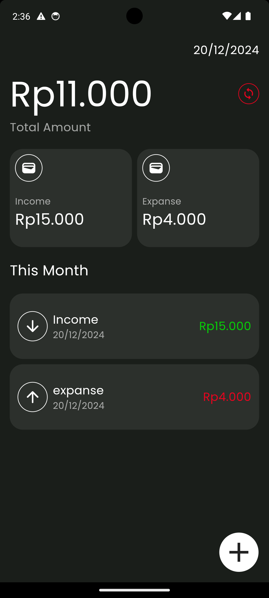

# Penny

**Where Savings Meet Simplicity**

Penny is a financial tracking application designed to help users easily manage their income and expenses. With a simple and user-friendly interface, Penny makes it easy to track, analyze, and optimize your spending habits. Whether you're budgeting for the month or saving for something special, Penny is here to simplify your financial journey.

## Features

- **Track Income & Expenses**: Easily add income and expense transactions and categorize them.
- **Real-time Summary**: View a real-time summary of your total balance, income, and expenses.
- **Transaction History**: Keep a log of all your past transactions and see your financial growth.
- **GetX for State Management**: Efficient state management with GetX to keep your UI responsive and smooth.

## Screenshots

Here are some screenshots of Penny in action:

_Home screen showing total balance, income, and expenses._

_Add a new transaction with category selection._

_Delete a transaction with a swipe or tap action._
